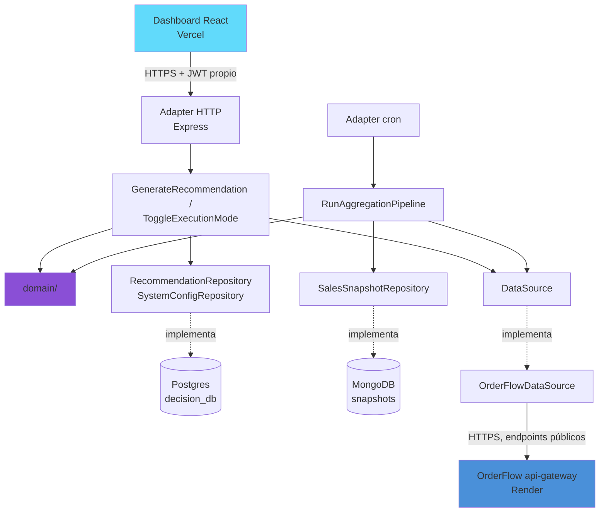

# Decision Engine

Backend de decisiones de marketing agéntico: genera recomendaciones auditables a partir de datos
de un sistema externo, con modo shadow/live y un pipeline de agregación — pensado para preparar
la aplicación a un rol de Senior Full Stack (Data4Sales) y, a propósito, **reusable más allá de
eso**: la fuente de datos es un adapter intercambiable, no está atado a un solo sistema.

> Proyecto nuevo y separado de [OrderFlow](../orderflow) — consume la API pública de OrderFlow
> igual que cualquier cliente externo lo haría (HTTPS + JWT normal), no comparte red interna,
> base de datos, ni el `x-internal-secret` que usan los servicios DENTRO del monorepo de
> OrderFlow. Ver el plan completo en el vault de Obsidian:
> `C:\dev\Proyecto\Sr-Backend-Roadmap\06-08 - Mutación...`.

## Por qué existe

Un aviso real de Sr Full Stack (backend .NET/C#, frontend React) pide: un motor de decisión
integrado a producción, recomendaciones auditables, shadow mode → primer envío con guardrails, y
comodidad con pipelines de datos. Este proyecto demuestra esos conceptos en el stack que ya
domino (Node/TypeScript) — la arquitectura y los trade-offs son lo que se transfiere a cualquier
lenguaje, no la sintaxis. El port a .NET queda explícitamente fuera de este proyecto (decisión
tomada, ver el vault).

## Principio de diseño: fuente de datos intercambiable

El motor de reglas nunca llama a OrderFlow directamente — llama a una interfaz `DataSource`.
Hoy hay un solo adapter (`OrderFlowDataSource`), pero cambiar la fuente de datos el día de mañana
(otro e-commerce, un CRM, lo que sea) es escribir un adapter nuevo, no tocar el motor. Es la
misma disciplina de "no acoplarse a un detalle de infraestructura" que ya se aplicó en OrderFlow
con Prisma/Redis/RabbitMQ detrás de sus propios módulos de `infra/`.

```typescript
interface DataSource {
  getBestsellers(limit: number): Promise<Product[]>;
  getCatalog(query?: { name?: string }): Promise<Product[]>;
}
```

## Arquitectura hexagonal (Ports & Adapters)

El dominio (reglas de recomendación, lógica de shadow/live) no importa nada de Express, Prisma,
el driver de Mongo, ni el cliente HTTP hacia OrderFlow — solo depende de **puertos** (interfaces)
que él mismo define. Los **adapters** (Postgres, Mongo, Redis, HTTP, OrderFlow) implementan esos
puertos desde afuera. Consecuencia práctica: cambiar de Postgres a otra base, o agregar una
segunda fuente de datos además de OrderFlow, es escribir un adapter nuevo — el dominio no se
entera.

```
src/
├── domain/                 # reglas de negocio puras, cero imports de infraestructura
│   ├── recommendation/     # entidad Recommendation + motor de reglas (2 reglas, ver abajo)
│   ├── executionMode/      # lógica de shadow/live + guardrail
│   └── catalog/             # ProductProfile, categorizador por keyword, simulador de métricas
├── ports/                  # interfaces que el dominio define y la infra implementa
│   ├── DataSource.ts
│   ├── RecommendationRepository.ts
│   ├── SystemConfigRepository.ts
│   ├── SalesSnapshotRepository.ts
│   ├── ProductProfileRepository.ts
│   └── RateLimiter.ts
├── application/             # casos de uso: orquestan dominio + puertos
│   ├── GenerateRecommendation.ts
│   ├── ToggleExecutionMode.ts
│   ├── RunAggregationPipeline.ts
│   ├── SyncProductCatalog.ts
│   └── ListProductProfiles.ts
├── adapters/
│   ├── inbound/
│   │   ├── http/            # Express: routes, controllers — llaman casos de uso
│   │   └── cron/             # dispara RunAggregationPipeline periódicamente
│   └── outbound/
│       ├── postgres/         # PrismaRecommendationRepository, PrismaSystemConfigRepository
│       ├── mongo/             # MongoSalesSnapshotRepository, MongoProductProfileRepository
│       ├── redis/             # RedisRateLimiter
│       └── orderflow/         # OrderFlowDataSource
└── shared/                   # logger, config/env, errores — cross-cutting, sin lógica de negocio
```

**Por qué dos bases de datos, con motivo real:** `Recommendation` y `SystemConfig` necesitan
integridad fuerte (el feature flag de modo no puede quedar en un estado ambiguo a medio escribir,
y las recomendaciones se auditan con filtros/rangos) → **Postgres**. `SalesSnapshot` es
esencialmente una serie temporal de snapshots — se escribe seguido, no tiene relaciones, y se lee
como una lista ordenada por fecha → **MongoDB**, mismo criterio que ya se usó en OrderFlow para
elegir Mongo en `notifications-service` (dato naturalmente schemaless/log-like, no relacional).



**Por qué no comparte RabbitMQ/red interna con OrderFlow:** son dos sistemas distintos con dueños
potencialmente distintos en el mundo real — acoplarlos por infraestructura compartida (una cola,
una base) rompe el punto de "reusar este backend para otras cosas". La integración es siempre
por API pública, el límite de bounded context más honesto entre dos productos separados.

**Endpoints de OrderFlow que usa (todos ya existen, público, sin cambios necesarios del lado de
OrderFlow):**
- `GET /products/bestsellers` — insumo principal del motor de reglas v1
- `GET /products` — catálogo completo, para reglas más ricas más adelante

Si más adelante hace falta data por-usuario (recomendaciones realmente personalizadas, no solo
por segmento/tendencia), el adapter puede loguearse con una cuenta de servicio dedicada
(`POST /auth/login` con credenciales propias en env vars, cachear el JWT 15 min, refrescar) y
pegarle a endpoints autenticados — el mecanismo ya está previsto en el adapter, no implementado
en v1 porque no hace falta todavía.

## Stack

- Node 24 + TypeScript + Express + Zod
- **PostgreSQL** (Prisma) — `decision_db`: `Recommendation`, `SystemConfig`
- **MongoDB** (driver oficial, sin ODM — mismo criterio que `notifications-service` de
  OrderFlow) — colección `salesSnapshots`
- Redis (ioredis) — guardrail de rate limit en modo `live` (mismo patrón que
  `loginRateLimiter` de OrderFlow)
- `node-cron` — dispara el pipeline de agregación periódicamente, sin orquestador externo
- Pino — logging estructurado
- Vitest — testing (el dominio, al ser puro, se testea sin mockear infraestructura)
- Auth propia y simple para el dashboard: JWT de un único rol "operador" (no hay multi-tenant
  todavía, es una herramienta interna) — simplificación deliberada, documentada como tal.

## Modelo de datos

**Postgres (`decision_db`, Prisma):**

```prisma
model Recommendation {
  id            String   @id @default(uuid()) @db.Uuid
  targetRef     String              // a quién/qué segmento apunta (simplificado: un id de producto o segmento, no un userId real de OrderFlow)
  ruleTriggered String              // qué regla disparó esto — auditable
  reason        String              // explicación en texto (a mano, o vía LLM más adelante)
  mode          Mode     @default(SHADOW)
  executedAt    DateTime?           // null mientras esté en SHADOW
  createdAt     DateTime @default(now())

  @@index([mode])
}

enum Mode {
  SHADOW
  LIVE
}

model SystemConfig {
  key   String @id      // "execution_mode" -> "shadow" | "live"
  value String
}
```

**MongoDB (colección `salesSnapshots`, sin schema fijo — validado en la capa de dominio, no en
la base):**

```typescript
interface SalesSnapshotDocument {
  _id: ObjectId;
  productId: string;
  productName: string;
  unitsSold: number;      // acumulado al momento del snapshot (viene de bestsellers)
  capturedAt: Date;
}
```

`SalesSnapshot` guarda una foto de `bestsellers` en cada corrida del pipeline — así se puede ver
tendencia en el tiempo (¿subió o bajó de ranking?) sin que OrderFlow necesite exponer nada nuevo.
Vive en Mongo porque es escritura frecuente, append-only, sin relaciones — forzarlo a una tabla
relacional no aportaría nada, solo rigidez.

**MongoDB (colección `productProfiles`) — catálogo enriquecido:**

```typescript
interface ProductProfileDocument {
  id: string;
  sku: string;               // nomenclatura CAT-SUB-#### — ver abajo
  orderFlowProductId: string; // link al producto real en OrderFlow
  name: string;
  price: string;
  category: { code: string; name: string };
  subcategory: { code: string; name: string };
  marketing: {
    viewCount: number;
    addToCartCount: number;
    purchaseCount: number;
    cartAbandonmentRate: number;    // 0-1, derivado: 1 - purchase/addToCart
    conversionRate: number;         // 0-1, derivado: purchase/views
    avgTimeInCartSeconds: number;
    avgDecisionTimeSeconds: number;
    peakPurchaseHour: number;       // 0-23
  };
  createdAt: Date;
  updatedAt: Date;
}
```

> ⚠️ **Las métricas de `marketing` son SIMULADAS, no reales.** OrderFlow solo trackea pedidos
> confirmados (no vistas, no carrito, no tiempos de navegación) — no hay de dónde sacar esos
> datos de verdad sin instrumentar tracking en OrderFlow, que está fuera del alcance de esta
> mutación. Se generan con `simulateMarketingMetrics()` (`domain/catalog/`), con un funnel
> internamente consistente (vistas → % que agrega al carrito → % de eso que compra — los 3
> conteos se relacionan entre sí, no son 3 números al azar sin relación) para poder construir y
> probar el motor de reglas que sí los consume, sin depender de tener tráfico real. Queda
> visible en el dashboard, no escondido.

**Nomenclatura de SKU — `CAT-SUB-####`:** categoría (3 letras) + subcategoría (3 letras) +
secuencia (4 dígitos, con padding). Ej.: `AUD-AUR-0001` = Audio → Auriculares → primer producto
de esa subcategoría. La categorización es por reglas de keyword sobre el nombre del producto
(`domain/catalog/ProductCategorizer.ts`) — determinística y auditable, mismo criterio que el
motor de recomendaciones: se puede explicar exactamente por qué un producto cayó en una
categoría, no es una caja negra. Categorías hoy: `COM` (Cómputo), `PAN` (Pantallas), `PER`
(Periféricos), `AUD` (Audio), `CON` (Conectividad y Energía), `MOB` (Mobiliario), `OFI`
(Oficina), con `GEN-PRO` como fallback si ninguna regla matchea.

## Endpoints

| Método | Ruta | Auth | Qué hace |
|---|---|---|---|
| POST | `/auth/login` | — | Login del operador (usuario único, ver "Stack") |
| POST | `/recommendations` | operador | Corre el motor de reglas contra datos frescos y persiste el resultado |
| GET | `/recommendations?mode=` | operador | Lista recomendaciones existentes, filtrable por modo |
| GET | `/recommendations/config` | operador | Modo actual (`SHADOW`/`LIVE`) |
| PATCH | `/recommendations/config` | operador | Cambia el modo global |
| GET | `/reports/sales-snapshots` | operador | Serie histórica de `SalesSnapshot`, para el dashboard |
| GET | `/catalog` | operador | Lista los `ProductProfile` (SKU, categoría, métricas de marketing) |
| POST | `/catalog/sync` | operador | Trae el catálogo de OrderFlow y crea un perfil para cada producto nuevo — idempotente, no duplica ni pisa perfiles existentes |
| GET | `/health` | — | Health real: Postgres, Redis, Mongo |
| GET | `/live` | — | Liveness puro, sin dependencias — lo que usa Render para decidir reinicios (ver mini-ADR de OrderFlow, mismo criterio aplicado desde el arranque acá) |

## Motor de reglas

Dos reglas independientes, combinadas en cada corrida y deduplicadas (si un producto matchea las
dos, se recomienda una sola vez):

1. **`top-3-bestseller-no-recomendado-recientemente`** — datos reales de OrderFlow
   (`GET /products/bestsellers`). "Este producto se vende bien, sigamos empujándolo."
2. **`alto-abandono-carrito-recuperable`** — datos simulados de `ProductProfile`: productos con
   ≥50% de abandono de carrito y ≥100 vistas (el piso de vistas evita recomendar por 2 vistas y 1
   abandono, que es ruido, no señal). "Hay interés real que no se convirtió, vale una campaña de
   recuperación." Es la traducción directa de "la empresa mejora ventas con técnicas de
   marketing, midiendo el carrito" a una regla ejecutable.

## Shadow mode y guardrail

- `SystemConfig.execution_mode = "shadow"` por defecto.
- Shadow: se genera y persiste la recomendación, `executedAt` queda `null`.
- Live: además, se marca `executedAt` (en un sistema real, acá dispararía el envío — para esta
  demo, marcar la ejecución y loguearla ya prueba el punto de auditabilidad).
- Guardrail: rate limit en Redis, máximo N recomendaciones ejecutadas en modo `live` por hora.

## Pipeline de agregación

Job programado (`node-cron`, corrido dentro del mismo proceso — no hace falta un orquestador
para este volumen) que cada N minutos:
1. Llama `OrderFlowDataSource.getBestsellers()`
2. Guarda un `SalesSnapshot` por producto
3. El motor de reglas de `/recommendations` lee los últimos snapshots para decidir

## Frontend (`frontend/`)

Dashboard del operador — proyecto aparte dentro del mismo repo (no un servicio más del backend,
es un cliente HTTP más de la API, igual que cualquier otro consumidor).

| | |
|---|---|
| **Stack** | React 19 + Vite + TypeScript, Tailwind CSS 4, TanStack Query (fetching/cache), React Router, Recharts, Axios |
| **Puerto (dev)** | 5173 |
| **Se comunica por** | HTTPS contra `decision-engine` (`VITE_API_BASE_URL`), con el JWT del operador en cada request |

```
frontend/src/
├── api/            # client.ts (axios + interceptor de auth), auth.ts, recommendations.ts, types.ts
├── auth/           # AuthContext — guarda el JWT en localStorage, expone useAuth()
├── components/     # Navbar, ProtectedRoute (redirige a /login si no hay sesión), ModeBadge
├── pages/          # LoginPage, RecommendationsPage, SnapshotsPage
├── App.tsx         # rutas
└── main.tsx        # providers: QueryClientProvider, BrowserRouter, AuthProvider
```

**Pantallas:**
- **Login** (`/login`) — el operador único (ver credenciales abajo).
- **Recomendaciones** (`/recommendations`) — botón "Generar recomendaciones" (dispara
  `POST /recommendations`), toggle de modo shadow/live, lista de recomendaciones con el `reason`
  siempre visible (la auditabilidad tiene que verse en la UI, no solo existir en la base) y un
  badge de modo por cada una.
- **Catálogo** (`/catalog`) — tabla de `ProductProfile`: SKU, categoría, precio, y las métricas
  de marketing (vistas, conversión, abandono de carrito resaltado si es alto, tiempo en carrito,
  hora pico) — con la aclaración de "simulado" visible en la propia pantalla, no solo en el
  código. Botón "Sincronizar catálogo" dispara `POST /catalog/sync`.
- **Tendencia de ventas** (`/snapshots`) — gráfico de línea (Recharts) + tabla de
  `SalesSnapshot`, un color por producto.

Auth: `ProtectedRoute` envuelve las rutas privadas y redirige a `/login` si no hay JWT guardado;
el token se adjunta automáticamente vía interceptor de Axios en cada request.

## Cómo correrlo todo en local

Tres piezas: infraestructura (Docker), backend, frontend — cada una en su propia terminal.

**1. Infraestructura** (Postgres + Mongo + Redis):
```bash
cd C:\dev\decision-engine
docker compose up -d postgres mongo redis
```

**2. Backend:**
```bash
cd C:\dev\decision-engine
npm install                  # primera vez
npx prisma migrate dev       # primera vez, crea las tablas
npm run dev                  # tsx watch, puerto 4100
```

**3. Frontend** (en otra terminal):
```bash
cd C:\dev\decision-engine\frontend
npm install                  # primera vez
npm run dev                  # Vite, puerto 5173
```

Abrir **http://localhost:5173**.

### Login de prueba

| Campo | Valor |
|---|---|
| Email | `operador@decision-engine.local` |
| Password | `operador123` |

Definidos en `.env` (raíz del proyecto, gitignorado) como `OPERATOR_EMAIL` +
`OPERATOR_PASSWORD_HASH` (hash bcrypt de esa password — nunca se guarda en texto plano, ni
siquiera en un `.env` local). Para generar un hash nuevo:
```bash
node -e "console.log(require('bcrypt').hashSync('tu-password', 12))"
```

## Roadmap

Ver `C:\dev\Proyecto\Sr-Backend-Roadmap\07 - Mutación - Roadmap y Checklist.md` en el vault de
Obsidian para el checklist accionable. Estado real: **backend (M0-M3) y frontend base (M4)
completos y verificados en vivo contra OrderFlow en producción** — falta pulir estilo del
frontend y la preparación de entrevista sobre el gap de .NET.
